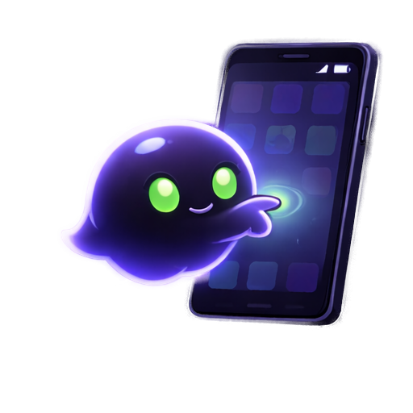

<p align="center">
  
</p>

<h1 align="center">Ghost in the Droid</h1>

<p align="center">
  <strong>Summon a ghost into your phone.</strong><br/>
  It sees the screen. It taps the buttons. It never sleeps.
</p>

<p align="center">
  <a href="https://ghostinthedroid.com">Website</a> &middot;
  <a href="https://ghostinthedroid.com/getting-started/installation/">Docs</a> &middot;
  <a href="https://ghostinthedroid.com/skills/">Skill Hub</a> &middot;
  <a href="https://github.com/ghost-in-the-droid/android-agent/releases/latest">Releases</a>
</p>

<p align="center">
  
  
  
  
  
</p>

---

<!-- HERO VIDEO. Served from a relative repo path so it plays on the private mirror preview AND the public repo, with no release-attach dependency. GitHub renders <video> inline; the poster + linked image are the fallback for older markdown renderers. -->
<p align="center">
  
</p>
<p align="center"><sub>▶ <a href="https://youtu.be/fdaXdFQo61o">Watch full HD with sound on YouTube</a> · <a href="docs/assets/hero-reel.mp4">Download mp4</a></sub></p>

<p align="center"><em>Nine agents. Nine real devices. One ghost. (Click to watch.)</em></p>

---

## The pitch, in one breath

Every AI agent can think. Almost none can touch a phone.

**Ghost is the body.** It gives any LLM agent a real Android phone or iPhone: it reads the screen, taps, swipes, and types through a clean tool surface, and it scales from one device on your desk to a whole phone farm. Point Claude Code, Codex, Antigravity, Cursor, your LangChain app, or a model running *inside the phone itself* at it, and your agent grows hands.

Bring your own brain. Keep the same body. MIT, forever.

---

## Mix and match: the Ghost matrix

Ghost 1.3 is the only Android + iOS agent framework where **platform**, **brain**, and **driver** are all swappable. Pick one from each column. They all compose.

| Pick a platform | Pick a brain | Pick a driver |
|---|---|---|
| **Android** over USB ADB | **Claude Code** (free with your Max/Pro sub) | **MCP client** (Claude Code, Codex, Antigravity, Cursor, Opencode) |
| **Android** over Wi-Fi ADB | **Anthropic API** | **LangChain** toolkit |
| **Android** in a **Docker + KVM** emulator pool | **OpenRouter** (any model, one key) | **LlamaIndex** tool spec |
| **iPhone** over Appium + WebDriverAgent *(experimental)* | **Ollama** (fully local) | **Ghost CLI** (`ghost "book a table" --device pixel`) |
| | **vLLM** (your own GPU) | **Web dashboard** chat with a live phone stream |
| | **On-device** (the model runs *in the phone*, airplane-mode works) | **REST API** (`/docs` OpenAPI) |

The body stays the same 62 MCP tools no matter what you plug in. Every new model release is a free upgrade to your phone agent.

---

## What It Does

Open-source Python framework for controlling Android and iOS devices from one agent harness. Android runs through ADB. iOS runs through Appium XCUITest and WebDriverAgent, with real iPhones as the target path and simulators for development and CI.

Define **skills** for any app, run them from the dashboard or API, scale across a phone farm.

**The ghost taps what you'd tap**
- Android control through ADB: tap, swipe, type, clipboard, shell, intents, and stealth variants
- iOS control through WebDriverAgent: screenshot, accessibility tree, tap, swipe, type, app launch, clipboard, browser actions
- Live phone screen streaming: Android MJPEG/WebRTC, iOS WDA MJPEG with screenshot fallback
- Interactive touch-to-tap on the streamed screen
- Multi-device phone farm with per-device job queues

**Forge reusable skills for any app**
- YAML-based UI element definitions per app
- Platform-specific selectors with `elements.yaml` for Android and `elements_ios.yaml` for iOS
- Python action classes with precondition checks
- Multi-step workflows that chain actions together
- Built-in skills for TikTok and Play Store
- iOS browser/news demo skill and smoke-level TikTok iOS workflows
- **Skill Hub**: browse, search, and install skills from the community registry
- Install from CLI: `android-agent skill install tiktok`

**Teach the ghost new tricks**
- BFS-based auto app explorer: discovers every screen and transition
- LLM-assisted Skill Creator: chat with AI while viewing the live device stream
- The AI identifies UI elements and generates action/workflow code

**Scale the haunting**
- Multi-device phone farm with per-device job queues
- Bot runner: queue, schedule, and monitor automation jobs
- Per-device integration tests with Android screen recording or iOS WDA MJPEG recording

### Platform Support

| Surface | Android | iOS |
|---------|---------|-----|
| Device ref | ADB serial, e.g. `emulator-5554` | `ios:<udid>` |
| Backend | ADB + optional Portal companion app | Appium XCUITest + WebDriverAgent |
| Real device support | Yes | Yes, with Mac/Xcode/WDA signing |
| Simulator/emulator support | Android emulator tooling | Booted iOS simulators via Appium/WDA |
| Live stream | Portal WebRTC, MJPEG, screencap | WDA MJPEG, screenshot polling fallback |
| Screen tree | Android UIAutomator XML | Normalized XCTest accessibility tree |
| Skills | `elements.yaml`, Android packages | `elements_ios.yaml`, iOS bundle IDs |
| Android-only today | ADB shell, intents, wireless ADB, Play Store helpers, Portal overlay | Unsupported with stable platform errors |

---

## Why it is built this way

**Skills cost $0. Thinking costs tokens.** An agent should not pay an LLM to tap a button it has tapped a thousand times. Known workflows compile to **skills**: deterministic YAML + Python recipes that replay in seconds with zero LLM calls. Use AI for the unknown task, replay for the known one.

**The phone is the easiest sandbox there is.** Give the ghost an old Android with its own SIM and its own accounts, physically separate from your life. You already know how to set up a phone.

**Zero-app by default.** A fresh install touches nothing on the Android device: screen reads go through `uiautomator`, actions through `adb shell input`, no root, no accessibility service. Want it faster? The optional Portal companion app gives roughly 30x quicker UI reads. Want it private? On-device mode runs the whole loop inside the phone, nothing leaves it. All opt-in.

**Local-first, cloud-optional.** The server and dashboard run on your machine. With a local or on-device brain, your screenshots never leave your network. Pick a cloud brain and prompts go to that provider, same as any tool. Your call, always.

---

## Requirements

- **Python 3.10+**
- **Android**: Android phone with USB debugging enabled and **ADB** on PATH (`adb devices` should list your phone)
- **iOS**: macOS with Xcode, Appium 2 + XCUITest driver, and a trusted iPhone or booted simulator
- **Node.js 18+** (for the frontend dev server)

---

## iOS Support (Experimental)

Ghost can also drive iPhones through Appium/WebDriverAgent with the same tool
surface: `ios:<udid>` device refs route tap/swipe/type/screenshot to WDA, and
iOS-aware browser primitives (`open_url`, `read_news`, `extract_visible_text`)
cover web tasks. Android-only tools (`shell`, `launch_intent`, Portal overlay)
return a clear platform error instead of failing silently.

iOS support is **feature-gated and OFF by default** while device testing
matures. Enable it with `GITD_ENABLE_IOS=1` (or `ios_platform_enabled=true`
in `.env`). Wireless drive rides your Tailscale tailnet, so treat the tailnet as
the trust boundary. See [docs/SETUP_IOS.md](docs/SETUP_IOS.md) for Appium/WDA
setup, and [docs/IOS_ONDEVICE.md](docs/IOS_ONDEVICE.md) to run the model on the
iPhone itself.

---

## Quick Start

Zero-install with [`uvx`](https://docs.astral.sh/uv/) (or `pipx`):

```bash
uvx ghost-in-the-droid doctor   # green/red preflight: python, adb on PATH, devices, ports, LLM keys
uvx ghost-in-the-droid login    # sign in with your Claude subscription, no API key needed
uvx ghost-in-the-droid up       # server + dashboard at http://localhost:5055  (API docs at /docs)
```

`doctor` prints a checklist with fix hints instead of a stack trace when something is missing (e.g. `adb` not on PATH). Prefer `pipx`? `pipx install ghost-in-the-droid` gives you the `ghost-in-the-droid` / `android-agent` commands.

### Sign in with your Claude subscription (no API key)

If you have a **Claude Max/Pro** subscription, you don't need an API key. `android-agent login` signs you in through the `claude` CLI's own Anthropic OAuth flow and points Ghost at the `claude-code` provider:

```bash
android-agent login       # opens Anthropic sign-in via the claude CLI
```

Ghost never handles or stores your token; the `claude` CLI owns it, refresh included. `doctor` shows a green **Claude subscription** check once you are signed in. To use an API key instead, set `ANTHROPIC_API_KEY` (or `OPENAI_API_KEY` / `OPENROUTER_API_KEY`) and pick that provider.

<details>
<summary>Run fully local with Ollama (no keys, no cloud)</summary>

Select Ollama in the Phone Agent tab. Runs entirely on your machine with [Ollama](https://ollama.com):

```bash
brew install ollama       # or: curl -fsSL https://ollama.com/install.sh | sh
ollama serve &
ollama pull llama3.2:3b   # 2GB, fast, good tool-use
```
</details>

<details>
<summary>From a clone (for development)</summary>

```bash
git clone https://github.com/ghost-in-the-droid/android-agent.git
cd android-agent
pip install -e ".[all]"

android-agent doctor        # preflight
android-agent up            # start server + dashboard on :5055

# Frontend (separate terminal)
cd frontend && npm install && npx vite --host 0.0.0.0 --port 6175
# Dashboard at http://localhost:6175
```
</details>

### iOS Quick Start

iOS support requires a Mac because Appium uses Xcode's XCUITest/WebDriverAgent stack. Real iPhones also require trust, Developer Mode, UI Automation permission when prompted, and WDA signing with an Apple development team.

```bash
# 1. Install and run Appium XCUITest
npm install -g appium
appium driver install xcuitest
appium --base-path /

# 2. Find your iPhone or booted simulator UDID
xcrun xctrace list devices
xcrun simctl list devices booted

# 3. Configure the backend for iOS
export IOS_DEVICE_UDID="<udid>"
export IOS_APPIUM_URL="http://127.0.0.1:4723"
export IOS_BUNDLE_ID="com.google.chrome.ios"       # or com.apple.mobilesafari
export IOS_MJPEG_SERVER_PORT="9100"                # use unique ports per iOS device

# 4. Run a product-path smoke workflow
uv run python scripts/ios_chrome_news_smoke.py \
  --device "ios:<udid>" \
  --bundle-id "$IOS_BUNDLE_ID" \
  --url https://text.npr.org/ \
  --max-headlines 5 \
  --max-articles 3 \
  --fix-health \
  --out-dir data/ios_chrome_news_smoke
```

For full real-device signing, simulator, WDA MJPEG, health recovery, scheduler, and MCP setup details, see [`docs/SETUP_IOS.md`](docs/SETUP_IOS.md).

### Environment Variables

Copy `.env.example` to `.env` (if provided) or create a `.env` file in the project root. The server reads configuration via Pydantic Settings. Optional variables include:

| Variable | Purpose |
|----------|---------|
| `OPENAI_API_KEY` | LLM features (Skill Creator, Agent Chat) |
| `ANTHROPIC_API_KEY` | Alternative LLM provider |
| `OPENROUTER_API_KEY` | OpenRouter LLM provider |
| `DEFAULT_DEVICE` | ADB serial (auto-detected if empty) |
| `IOS_DEVICE_UDID` | iPhone or simulator UDID; devices are addressed as `ios:<udid>` |
| `IOS_APPIUM_URL` | Appium server URL, default `http://127.0.0.1:4723` |
| `IOS_BUNDLE_ID` | Default iOS app/browser bundle, e.g. `com.google.chrome.ios` or `com.apple.mobilesafari` |
| `IOS_DEVICES_JSON` | Per-device iOS config for multiple phones/simulators, WDA ports, bundle IDs, and MJPEG ports |
| `IOS_MJPEG_SERVER_PORT` | WDA MJPEG stream port; use one unique port per iOS device |

---

## Give any AI agent a mobile body (MCP)

Ghost ships an [MCP](https://modelcontextprotocol.io) server with **62 tools** for real-device control. Any MCP-compatible client can use them. Android serials receive the Android implementation; `ios:<udid>` refs route to the iOS backend where supported and return stable unsupported-platform errors for Android-only tools. One command wires it up:

```bash
# Claude Code (same shape for Codex, Cursor, VS Code Copilot, Windsurf)
claude mcp add android-agent -- uvx --from ghost-in-the-droid android-agent-mcp
```

`uvx` installs the package, builds an isolated env, and runs the server. No clone, no venv.

<details>
<summary>Other clients (Codex, Claude Desktop, Cursor, VS Code, Windsurf)</summary>

```bash
# Codex (OpenAI)
codex mcp add android-agent -- uvx --from ghost-in-the-droid android-agent-mcp
```

**Claude Desktop** (`claude_desktop_config.json`), **Cursor** (`.cursor/mcp.json`), **Windsurf** (`mcp_config.json`):
```json
{
  "mcpServers": {
    "android-agent": {
      "command": "uvx",
      "args": ["--from", "ghost-in-the-droid", "android-agent-mcp"]
    }
  }
}
```

**VS Code Copilot** (`.vscode/mcp.json`) uses the same block under a `"servers"` key. Contributors who clone the repo get a ready `.mcp.json`, all 62 tools live on first `claude` launch.
</details>

**The 62 tools, by category:**

| Category | What the ghost can do |
|----------|-----------------------|
| **See** | `screenshot`, `get_elements`, `get_screen_tree`, `get_screen_xml`, `screenshot_annotated`, `screenshot_cropped` |
| **Touch** | `tap`, `tap_element`, `swipe`, `long_press`, `type_text`, `type_unicode`, `press_back`, `press_home`, `press_key` |
| **Apps** | `launch_app`, `search_apps`, `list_apps`, `launch_intent`, `force_stop`, `list_packages` |
| **Understand** | `get_phone_state`, `classify_screen`, `find_on_screen`, `ocr_screen`, `ocr_region`, `extract_visible_text` |
| **Browser / iOS** | `open_url`, `browser_back`, `get_current_url`, `read_news`, `extract_articles`, `wait_for_text` |
| **Device** | `list_devices`, `clipboard_get`, `clipboard_set`, `get_notifications`, `open_notifications`, `toggle_overlay`, `device_health` |
| **Skills** | `list_skills`, `run_workflow`, `run_action`, `create_skill`, `explore_app` |
| **Batch** | `run_flow` / `chain`: one call runs a whole multi-step recipe server-side, N round-trips collapse to 1 |
| **Diagnostics** | `list_crashes`, `get_crash`, `web_search`, screen recording, camera + TTS |

`toggle_overlay`, `launch_intent`, Android shell helpers, wireless ADB, and Play Store helpers remain Android-only and return stable platform errors on iOS.

---

## Run the brain inside the phone

New in 1.3: the model can live *on the device*. The Ghost companion app embeds real inference engines, so the phone is both the body and the brain. Airplane mode on, agent still working, nothing leaving the device.

| Platform | Engine | Model format | Best for |
|----------|--------|-------------|----------|
| Android | **llama.cpp** (JNI) | `.gguf` | Any GGUF: Gemma, Llama, Mistral, Qwen, DeepSeek |
| Android | **MediaPipe** | `.task` | Small Gemma models, fastest Android integration |
| iPhone | **llama.cpp** (Metal) | `.gguf` | Same GGUF as Android, Qwen2.5 1.5B on Metal |
| iPhone | **MLX** | Apple Silicon | Faster decode on newer chips, opt-in |

On iPhone, Qwen2.5 1.5B runs through llama.cpp on Metal and drives the phone's own UI, with an opt-in MLX engine for faster decode on Apple Silicon. Small models are kept honest with grammar-constrained decoding so tool calls always parse. Full detail in [docs/IOS_ONDEVICE.md](docs/IOS_ONDEVICE.md).

---

## Skill Hub CLI

```bash
android-agent skill search tiktok        # search the public registry
android-agent skill install tiktok       # install a skill
android-agent skill install github.com/someone/their-skill
android-agent skill list                 # what is installed
android-agent skill update tiktok        # update a skill
android-agent skill validate ./my-skill/ # check before publishing
```

The skill registry lives in [`registry/`](registry/) in this repo. Community skills are auto-discovered nightly from repos tagged `android-agent-skill`.

## Teach the Ghost a New App

Two ways to forge a skill:

**Community skill** (your own repo): create a repo with `skill.yaml`, `elements.yaml`, actions, and workflows, tag it `android-agent-skill`, and it appears on the [Skill Hub](https://ghostinthedroid.com/skills/) automatically (nightly scraper).

**Official skill** (PR to this repo): build and test as a community skill first, then open a PR adding it to [`registry/`](registry/). CI validates, a maintainer reviews, and it gets the "Official" badge.

Each skill needs:
- `skill.yaml`: metadata (name, version, app package or iOS bundle ID, supported platforms, actions, workflows)
- `elements.yaml`: Android UI element resource IDs and descriptions
- `elements_ios.yaml`: optional iOS selectors for XCTest accessibility trees
- `actions/`: Python classes extending `Action` with `precondition()` and `execute()`
- `workflows/`: Python classes extending `Workflow` with `steps()`

Prefer to let AI do it? The **Skill Creator** watches a live device stream and generates the action and workflow code while you narrate. Full guide in [CONTRIBUTING.md](CONTRIBUTING.md).

---

## The dashboard

A local-first control room at `http://localhost:5055` (or `:6175` in dev). WebRTC and MJPEG live streams, tap-on-screen, tracing, and every tab below.

| Tab | What it does |
|-----|-------------|
| Phone Agent | Live device stream (MJPEG/WebRTC), tap/swipe on screen, multi-device view |
| Scheduler | Cron-style job scheduling with queue management |
| Skill Hub | Browse installed skills, run actions and workflows, export/delete |
| Skill Creator | LLM-assisted skill builder with live device stream |
| Skill Miner | Auto app explorer: BFS state discovery with screenshots |
| Manual Run | Start/stop bot jobs, queue management, logs |
| Tests | Per-device test runner with screen recording playback |
| Emulators | Create, boot, snapshot, and manage Android emulators |
| Tracing | Per-turn traces, token accounting, tool-call visibility |

---

## Architecture

```
android-agent/
  run.py                    # Uvicorn entry point on :5055
  gitd/
    app.py                  # FastAPI app factory + plugin hook
    models/  schemas/       # SQLAlchemy 2.0 ORM + Pydantic v2
    routers/  services/     # Route handlers + business logic
    skills/                 # Skill packages (tiktok, play_store, safari [iOS], tiktok_ios)
    bots/common/adb.py      # Android Device class: tap, swipe, dump tree, wait_for
    bots/common/ios.py      # iOS Device class: Appium/WDA session, UI tree, gestures
    mcp_server.py           # MCP server: 62 tools for any LLM agent
  frontend/                 # Vue 3 + Vite + TypeScript + Tailwind
  portal/                   # Kotlin companion app (WebRTC, on-device inference)
  site/                     # Docs site (Astro + Starlight)
```

**The flow:** FastAPI backend on `:5055` exposes device control, skills, bots, scheduling, and streaming. The Vue SPA talks to it over `/api/*`. Skills define per-app interaction (elements + actions + workflows). Device backends route by ref: bare serials use `bots/common/adb.py`, `ios:<udid>` refs use `bots/common/ios.py` and Appium/WDA. State lives in SQLite via SQLAlchemy 2.0 and Alembic.

<!-- BENCHMARK: sneak-peek only per CKL directive (number is preview, no methodology/trajectories published yet). Public README is high-scrutiny; CKL to explicitly approve keeping this block, else cut. -->
## Benchmark (sneak peek)

Early result, with the full methodology writeup still cooking: driven by Claude Code, Ghost completes **115 of 116 tasks (99.1%)** on [AndroidWorld](https://github.com/google-research/android_world), Google Research's benchmark for Android agents, on the unmodified upstream harness. Treat this as a preview rather than a citable number. The detailed writeup and trajectories are coming. Watch the [releases](https://github.com/ghost-in-the-droid/android-agent/releases/latest).

---

## Tech Stack

| Layer | Technology |
|-------|-----------|
| Backend | FastAPI, Uvicorn, Python 3.10+ |
| Data | SQLAlchemy 2.0, Alembic, Pydantic v2, SQLite (WAL) |
| Frontend | Vue 3, TypeScript, Vite, Tailwind CSS 4 |
| Device control | ADB for Android; Appium XCUITest/WebDriverAgent for iOS |
| Streaming | Android MJPEG/WebRTC via Portal; iOS WDA MJPEG plus screenshot fallback |
| On-device | llama.cpp, MediaPipe (Android); llama.cpp on Metal, MLX (iOS) |
| Quality | Ruff, pytest, Playwright |

---

## Running Tests

Most tests are unit/API tests and run without a live device. Live Android and iOS integration tests require the relevant device stack.

```bash
# Run all tests on a specific device
DEVICE=<serial> python3 -m pytest tests/ -v --tb=short
```

For iOS live smoke tests:

```bash
IOS_LIVE_NEWS_TEST=1 \
IOS_DEVICE_UDID="<udid>" \
IOS_APPIUM_URL="http://127.0.0.1:4723" \
IOS_BUNDLE_ID="com.google.chrome.ios" \
uv run --extra test python -m pytest tests/test_browser_news.py::test_live_ios_chrome_news_workflow
```

Get your Android device serial from `adb devices`.

---

## Database Migrations

The project uses Alembic for schema migrations:

```bash
alembic revision --autogenerate -m "add new_field to my_table"   # after editing a model
alembic upgrade head                                              # apply pending
alembic downgrade -1                                              # rollback one
```

---

## Contributing

The ghost gets stronger with every skill. See [CONTRIBUTING.md](CONTRIBUTING.md) for adding app skills (highest impact), writing actions and workflows, backend architecture, and the PR process. Join the community on the [Skill Hub](https://ghostinthedroid.com/skills/).

---

## License

[MIT](LICENSE). The ghost is free. The ghost is open source. The ghost is yours.
