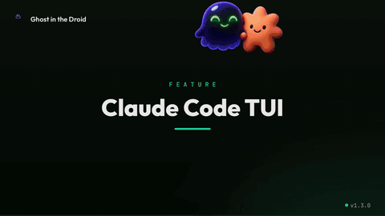
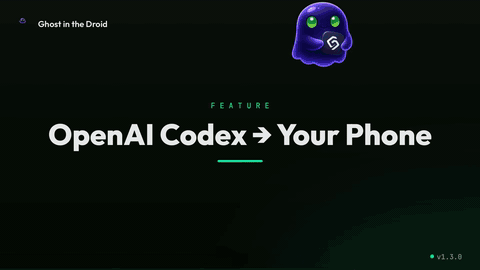
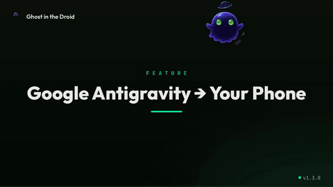
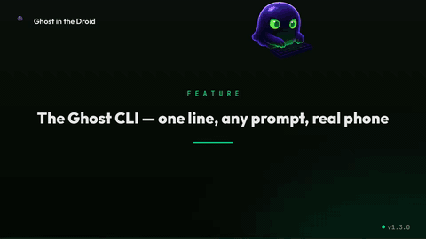
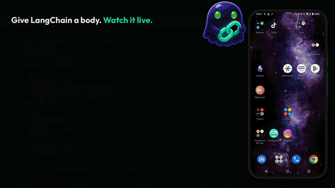
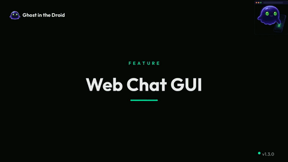
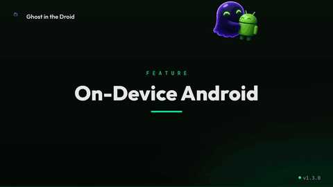
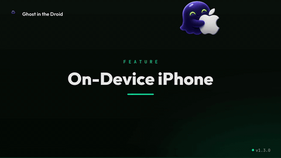
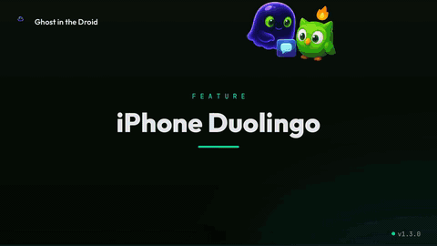

# Ghost in the Droid v1.3.0

_Release candidate — target ship: TBD_

<!-- Hero reel served from a relative repo path so it plays on the mirror preview AND the public repo. Poster + linked image are the older-renderer fallback. -->
<p align="center">
  <video src="https://github.com/ghost-in-the-droid/android-agent-private-mirror/releases/download/v1.3.0-preview-assets/hero-reel.mp4" poster="../assets/hero-poster.jpg" width="820" controls muted playsinline>
    
  </video>
</p>
<p align="center"><sub>▶ Inline player above (with sound). GIF fallback for older readers.</sub></p>

<p align="center"><em>Nine agents. Nine real devices. One ghost.</em></p>

## What v1.3.0 is

Ghost 1.3 turns Ghost in the Droid from an Android automation harness into a full **agent runtime for real phones**. The headline additions: a model that runs **on the phone itself**, **experimental iOS support**, first-class **LangChain and LlamaIndex** adapters, a unified task-first **`ghost` CLI**, and a batch of **agent-harness primitives** (`chain`, vision sub-agents, differential a11y, robust backoff) that make long autonomous runs cheaper and more reliable.

**62 MCP tools** across raw ADB control, screen understanding, skill workflows, batched execution, web search, TTS, camera, and crash diagnostics. Same skill engine. Same phone-as-body model. What changes in 1.3 is the brain — you can now bring any brain, or run one entirely on-device.

## New in 1.3

<!-- Fact-checked 2026-07-18 against CHANGELOG.md version sections + git history. Every bullet below is in the [1.3.0] CHANGELOG section (Added/Changed/Fixed/Security). WebRTC live streaming was deliberately NOT listed here: it is a [1.0.0] feature (CHANGELOG line ~101), so it lives only in the descriptive phone-side section, not in "New in 1.3". Emulator/Ollama/MCP-distribution/Ghost-Bench correctly moved to "Also refined" (v1.1/v1.2 origins). -->

The features that didn't exist before this release:

- 🍏 **iOS support (experimental)** — drive iPhones via Appium/WebDriverAgent with the same tool surface (`ios:<udid>` refs, platform-routed tap/type/screenshot, iOS browser primitives). Feature-gated, **off by default**.
- 📱 **On-device inference** — a Gemma model runs *inside* the Android app via MediaPipe (`.task`) or llama.cpp (`.gguf`). Airplane mode, $0 per call, nothing leaves the phone. **New backend.**
- ⚡ **vLLM backend** — point Ghost at your own GPU box for full-precision open models. **New backend.** (On-device + vLLM bring the provider lineup to six.)
- 🔗 **LangChain + LlamaIndex adapters** — Ghost's exec surface as native framework tools, behind one shared fail-closed allow-list.
- ⌨️ **Task-first `ghost` CLI** — `ghost "check reddit" --device asus`. First-run wizard, `ghost mcp install --client …`; `gitd` / `android-agent` keep working.
- 🧨 **`run_flow` + `chain`** — batched execution (MCP and agent-loop). One round-trip instead of N; the whole batch is pre-validated against the safe-tool allow-list.
- 🧰 **Agent-harness primitives** — `screenshot_sequence` + `sub_agent` vision sub-calls, differential a11y diffs, ASCII transliteration for `type_text`, rate-limit backoff + effort-scaled timeouts. Long autonomous runs get cheaper, more legible, more robust.
- 🔐 **Subscription login** — `android-agent login` brings your Claude Pro/Max plan, no API key.
- 🔍 **Tracing + observability** — per-turn traces, token accounting, tool-call visibility.
- 🩺 **`list_crashes` / `get_crash` + `web_search`** — no-root crash/ANR reports; agent search mid-conversation.
- 🔌 **Marketing jobs seam** — `POST /api/marketing-jobs/enqueue` for external orchestrators.
- 🔐 **First community security patch** — CORS/CWE-352, thanks [@sebastiondev](https://github.com/sebastiondev).

## Also refined in 1.3

Not new — these shipped earlier — but better this release:

- **Ollama** *(backend since v1.1)* — still the zero-key local option; now also reachable as a brain behind the new LangChain/LlamaIndex adapters.
- **Emulator support** *(since v1.1)* — new **Docker+KVM backend** replaces the broken native `avdmanager` path on Linux.
- **MCP distribution / PyPI** *(since v1.1)* — now installed for you by `ghost mcp install --client claude-code|cursor|codex|opencode`.
- **Six LLM backends** — Claude Code, the Anthropic API, OpenRouter, and Ollama were already here (v1.0–v1.1); 1.3 adds on-device Gemma and vLLM.
- **Ghost Bench** *(since v1.2)* — unchanged in 1.3; the AndroidWorld groundwork continues.

---

## See it in action

Nine demos, one per feature, each recorded on real devices. (GitHub plays these inline; click through to the file if your renderer shows only the poster.)

**MCP clients: point your agent at a phone**

<table>
<tr>
<td width="33%"><video src="https://github.com/ghost-in-the-droid/android-agent-private-mirror/releases/download/v1.3.0-preview-assets/mcp-claude-code-tui.mp4" width="260" controls muted playsinline></video><br/><sub><b>Claude Code</b>: type in the TUI, watch it drive the phone.</sub></td>
<td width="33%"><video src="https://github.com/ghost-in-the-droid/android-agent-private-mirror/releases/download/v1.3.0-preview-assets/mcp-codex-tui.mp4" width="260" controls muted playsinline></video><br/><sub><b>Codex</b>: OpenAI's CLI operating a real phone over MCP.</sub></td>
<td width="33%"><video src="https://github.com/ghost-in-the-droid/android-agent-private-mirror/releases/download/v1.3.0-preview-assets/mcp-agy-tui.mp4" width="260" controls muted playsinline></video><br/><sub><b>Antigravity</b>: Google's agent, same 62-tool body.</sub></td>
</tr>
</table>

**Interfaces: CLI, framework, browser**

<table>
<tr>
<td width="33%"><video src="https://github.com/ghost-in-the-droid/android-agent-private-mirror/releases/download/v1.3.0-preview-assets/ghost-cli.mp4" width="260" controls muted playsinline></video><br/><sub><b>Ghost CLI</b>: `ghost "check reddit" --device asus`.</sub></td>
<td width="33%"><video src="https://github.com/ghost-in-the-droid/android-agent-private-mirror/releases/download/v1.3.0-preview-assets/langchain.mp4" width="260" controls muted playsinline></video><br/><sub><b>LangChain</b>: Ghost's tools in a framework agent.</sub></td>
<td width="33%"><video src="https://github.com/ghost-in-the-droid/android-agent-private-mirror/releases/download/v1.3.0-preview-assets/web-chat-gui.mp4" width="260" controls muted playsinline></video><br/><sub><b>Web chat</b>: chat in your browser, it drives a real phone.</sub></td>
</tr>
</table>

**On-device and iOS: the phone as body and brain**

<table>
<tr>
<td width="33%"><video src="https://github.com/ghost-in-the-droid/android-agent-private-mirror/releases/download/v1.3.0-preview-assets/on-device-android.mp4" width="260" controls muted playsinline></video><br/><sub><b>On-device Android</b>: model runs in the app, airplane mode.</sub></td>
<td width="33%"><video src="https://github.com/ghost-in-the-droid/android-agent-private-mirror/releases/download/v1.3.0-preview-assets/on-device-ios.mp4" width="260" controls muted playsinline></video><br/><sub><b>On-device iPhone</b>: your iPhone talks to itself.</sub></td>
<td width="33%"><video src="https://github.com/ghost-in-the-droid/android-agent-private-mirror/releases/download/v1.3.0-preview-assets/iphone-duolingo.mp4" width="260" controls muted playsinline></video><br/><sub><b>iPhone, real app</b>: Ghost does the Duolingo lesson.</sub></td>
</tr>
</table>

---

## The Android app / phone-side

The core Ghost value prop is: **your phone becomes the agent's body**. In v1.3 that story sharpens on three axes.

### Local device, no cloud

Everything works fully local:
- USB / Wireless ADB → your phone
- Local model (Ollama on your box, or on-device Gemma on the phone itself)
- Ghost dashboard + MCP server on `localhost`
- No API keys required, no cloud round-trips, no telemetry

Point Claude Code, Cursor, Codex, Windsurf, Claude Desktop, or ChatGPT at the local MCP endpoint — same 62 tools, whichever brain you like.

### On-device inference (⭐)

This is the piece the whole v1.3 story hinges on: **the LLM itself can now run on the phone**. No cloud, no key, no API cost — the model file sits in the app's assets, the Kotlin runtime drives inference, Python drives the tool-use loop, and the phone talks to itself.

#### Architecture

```
Ghost server (Python, your box)
    │  provider = "on-device"
    │  ADB → phone
    ▼
Ghost companion APK (Kotlin, on phone)
    │
    ├── Chaquopy — embedded CPython 3.11
    │     └── gitd.services.agent_chat_ondevice
    │           tool loop, streaming, tracing
    │
    └── OnDeviceLLM.INSTANCE  (Kotlin singleton)
          │  jclass bridge: Python ← → Kotlin
          │
          ├── MediaPipe engine (.task files)
          │     LlmInference API, Gemma 3 1B/3B/4B mobile bundles
          │
          └── llama.cpp engine (.gguf files)
                JNI, any quantization, custom fine-tunes
```

The Python side calls `_kotlin_llm()` which returns the Kotlin singleton via Chaquopy's `jclass("com.ghostinthedroid.app.ondevice.OnDeviceLLM").INSTANCE`. From there `inference(prompt) → completion` behaves like any other provider — the tool-use loop, tracing, and observability layer all wrap it identically.

#### Two engines, one interface

| Engine | Model format | Best for | Speed (Gemma 3 1B, Pixel 8 Pro) |
|---|---|---|---|
| **MediaPipe** | `.task` (Google mobile bundle) | Official Gemma 3 mobile builds, easiest setup | ~50 tok/s |
| **llama.cpp** | `.gguf` (any quantization) | Custom fine-tunes, aggressive quant, alt families | ~35 tok/s |

Model registry: `session.model = "gemma-4-e2b-it"` (MediaPipe path) or `"gemma-2-2b-it-Q4_K_M"` (llama.cpp path). Swap the engine by swapping the model id.

Q4_0 4B quantizations fit under 3 GB device RAM. Airplane mode works end-to-end — verified on Pixel 7 / Pixel 8 / Samsung S24 series.

#### On iPhone too (new)

The on-device story now mirrors onto iOS. A native SwiftUI app runs the model and the agent loop entirely on the iPhone, so the phone talks to itself in airplane mode, no cloud round-trip.

| iOS engine | Model format | Status |
|---|---|---|
| **llama.cpp** (Metal) | `.gguf` | Shipping. Qwen2.5 1.5B decodes on Metal; the *same GGUF that runs on Android* runs unmodified on iPhone. |
| **MLX** (Apple Silicon) | MLX quant | Ships opt-in. Slots behind the same `InferenceEngine` protocol for roughly 1.4 to 1.8x faster decode on newer chips. |

Small models are kept reliable with grammar-constrained decoding, so tool calls always parse. Full detail in [docs/IOS_ONDEVICE.md](../IOS_ONDEVICE.md).

#### Ghost-Gemma — trained for tool use

Vanilla Gemma is polite but flaky at multi-turn tool use, especially the flat tool-call shape mobile inference tends to emit. We shipped [**Ghost-Gemma**](https://huggingface.co/ghost-in-the-droid) — a light fine-tune of Gemma 3 1B, trained specifically on Ghost's flat-shape tool-call trajectories so on-device tool use lands reliably instead of being a coin flip.

Bring your own model too. The parser (`normalize_tool_call`) accepts both flat (`{tool, device, args}`) and nested (`{tool, args: {device, ...}}`) shapes so any Gemma-family model works out of the box; the fix in [#10](https://github.com/ghost-in-the-droid/android-agent/pull/10) unblocked training-time shape mismatches that were silently dropping args.

#### Chat template fix

Earlier drafts used a custom `[SYSTEM]/[USER]/[ASSISTANT]` scaffold that Gemma had never seen in fine-tuning. It cheerfully echoed the scaffold back into its own output, creating repetition loops where the model kept "writing" fake user turns from inside its reply. v1.3 switches to Gemma's canonical `<start_of_turn>user … <end_of_turn>` / `<start_of_turn>model` markers — coherence on multi-turn tool chains is now stable.

### Live phone streaming (WebRTC + MJPEG)

The dashboard shows a live 720x1280 preview of each connected phone. Two paths:

- **WebRTC** — the primary path. Server acts as a signaling proxy; the on-device Ghost Portal APK captures the screen via `MediaProjection` and streams to the browser peer directly. Sub-second latency.
- **MJPEG fallback** — for browsers / devices where WebRTC is disabled, an MJPEG stream over HTTP kicks in automatically.

Ghost supports **both** the Droidrun Portal APK (`com.droidrun.portal`) and its own **Ghost Portal** fork (`com.ghostinthedroid.portal`) — auto-detects which one is installed. Streaming features:

- Multi-device grid view in the dashboard (each phone as its own live tile)
- FPS + latency overlay (for perf tuning)
- Element-bbox overlay (matches the `screenshot_annotated` + `get_elements` state)
- Recording via `ffmpeg` for offline replay
- Streaming metadata via `/api/phone/webrtc-signal` and `/api/phone/stream-info`

Prerequisites: install the portal APK on the phone once (`adb install portal.apk`) and enable the accessibility service. `doctor` checks the install + service are live.

### `list_devices` → phone tabs → skills

Once you plug a phone in:

```bash
$ android-agent doctor
[✓] adb 34.0.5
[✓] Java 17 for adb-portal
[✓] MCP server dependencies
[✓] Devices: 1 connected (Pixel 8 Pro, serial ABC…)
[✓] Claude subscription: logged in (christian@example.com)

$ android-agent up
Ghost in the Droid v1.3.0
API:       http://127.0.0.1:5055
Dashboard: http://127.0.0.1:5055/
MCP:       stdio (via `python -m gitd.mcp_server`) or http://127.0.0.1:8002/mcp
```

The dashboard shows each connected phone as a live tab: screen preview, element tree, `explore_app` graph, skill runner, crash log, and per-app benchmark history.

---

## 62 MCP tools: the inventory

| Tier | Tool | What it does |
|---|---|---|
| **Raw control** | `list_devices` | List connected phones with serial + model |
|  | `screenshot` | Base64 PNG of current screen |
|  | `get_elements` | JSON array of all UI elements (idx, text, bounds, clickable) |
|  | `get_phone_state` | Current app, activity, keyboard state, focused element |
|  | `tap` | Tap at (x, y) coordinates |
|  | `tap_element` | Tap element by idx from `get_elements()` |
|  | `swipe` | Swipe (x1,y1)→(x2,y2) with duration |
|  | `type_text` | Type ASCII text into focused field |
|  | `type_unicode` | Type emoji / CJK via ADBKeyboard |
|  | `press_back` | Android Back button |
|  | `press_home` | Android Home button |
|  | `press_key` | Any key event (POWER, VOLUME_UP, ENTER, etc.) |
|  | `launch_app` | Launch app by package name |
|  | `long_press` | Long press at coordinates |
|  | `open_camera` | Open camera in mode = `photo` / `video` / `selfie` / `selfie_video`, with timer presets |
|  | `speak_text` | On-phone TTS — audio emitted from the phone speaker |
|  | `search_apps` | Fuzzy search installed apps |
|  | `list_apps` | List installed apps (packages + labels) |
| **Screen reading** | `get_screen_tree` | Structured UI tree with hierarchy |
|  | `get_screen_xml` | Raw Android UI hierarchy XML |
|  | `screenshot_annotated` | Screenshot with element bounding boxes drawn |
|  | `screenshot_cropped` | Crop a region of the screen |
|  | `ocr_screen` | OCR all text on screen |
|  | `ocr_region` | OCR a specific screen region |
|  | `classify_screen` | Identify which app/screen is showing |
|  | `toggle_overlay` | Toggle element overlay on device |
|  | `clipboard_get` / `clipboard_set` | Read/write clipboard |
|  | `paste_text` | Paste text via clipboard round-trip |
|  | `get_notifications` | Read notification shade |
|  | `open_notifications` | Pull down notification shade |
|  | `find_on_screen` | Find element by text or description |
| **Web + intent** | `web_search` | Query the web mid-conversation (via configured search provider) |
|  | `launch_intent` | Fire an Android intent with action / data / package / extras |
| **Skills** | `list_skills` | List installed skills with actions/workflows |
|  | `run_action` | Run a single skill action (e.g. `tiktok/open_app`) |
|  | `run_workflow` | Run a skill workflow (multi-step) |
|  | `create_skill` | Author a new skill from a JSON step list |
| **Batch** | `run_flow` ⭐ | Batched multi-step execution — one call, N ordered actions, fail-closed allow-list, injection blocklist |
| **Discovery** | `explore_app` | BFS explore an app's UI, returns state graph |
| **Diagnostics** | `list_crashes` | Recent crashes + ANRs from `logcat -b crash -b events` |
|  | `get_crash` | Full stack + context for a specific crash |
|  | `device_health` | Device readiness snapshot (adb, portal, keyboard, storage) |
|  | `fix_device_health` | Guided remediation for common device issues |
| **Browser / web** | `open_url` | Open a URL in the device browser (Android + iOS) |
|  | `get_current_url` | Read the current browser URL |
|  | `browser_back` | Browser back navigation |
|  | `read_news` | Open and read a news source's articles |
|  | `extract_articles` | Extract the article list from the current page |
|  | `extract_visible_text` | Extract all visible text from the current screen/page |
|  | `wait_for_text` | Block until text appears on screen (with timeout) |
|  | `wait` | Pause for N seconds inside a flow |
| **Recording** | `start_screen_recording` | Begin an on-device screen recording |
|  | `stop_screen_recording` | Stop and save the recording |
|  | `screen_recording_status` | Query recording state |
|  | `get_stream_info` | Live stream metadata (WebRTC/MJPEG) |
| **System** | `app_state` | Foreground app + activity + state snapshot |
|  | `list_packages` | List installed package names |
|  | `force_stop` | Force-stop an app by package |
|  | `clear_notifications` | Clear the notification shade |
| **CRM** | `crm_lookup_contact` | Look up a contact record for a device/thread |
|  | `crm_list_unread_messages` | List unread inbound messages |

<sub>62 tools total. A handful are platform- or feature-scoped: iOS refs get the cross-platform + browser subset; Android-only escape hatches (`shell`, `launch_intent`, `toggle_overlay`) return a clear platform error on iOS. See `gitd/services/tool_platforms.py` for the authoritative per-tool matrix.</sub>

### Verified MCP clients

Every stdio / HTTP client we could find, tested with the same tool set:

| Client | Transport | Tested |
|---|---|---|
| [Claude Code](https://claude.com/claude-code) | stdio + http | ✅ |
| Claude Desktop | stdio | ✅ |
| [Cursor](https://www.cursor.com/) | stdio | ✅ |
| [Codex CLI](https://github.com/openai/codex) | stdio | ✅ |
| [Windsurf](https://windsurf.com/) | stdio | ✅ |
| Zed / Continue / Cline | stdio | ✅ |
| OpenClaw | stdio + http | ✅ |
| ChatGPT (via OpenAPI) | REST | ✅ |
| GPT Actions | REST | ✅ |

### `run_flow` — batched execution

Instead of N tool round-trips, send an ordered list. Server executes them under one allow-list check + one injection filter pass. Big latency + token win for scripted workflows.

```json
{
  "tool": "run_flow",
  "device": "ABC…",
  "steps": [
    {"tool": "press_home"},
    {"tool": "launch_app", "package": "com.google.android.apps.docs"},
    {"tool": "wait", "seconds": 1},
    {"tool": "tap_element", "idx": 4},
    {"tool": "type_text", "text": "Meeting notes"}
  ]
}
```

Allow-list is a **shared frozenset** with the LangChain / LlamaIndex adapters — `SAFE_DEVICE_TOOLS === FLOW_ALLOWED_TOOLS`. They cannot drift. A new / unknown tool is refused by default; opt-in is by explicit code change, not config.

---

## The agent harness

v1.3 is where Ghost stops being "MCP tools on a phone" and becomes a real agent harness. A batch of primitives (contributed via the Ghost Bench work) make long, autonomous runs cheaper, more legible, and more robust. Each is documented on its own feature page.

- **[`chain`](https://ghostinthedroid.com/features/chain/)** — batch an ordered list of sub-actions into one call, settling between each (`stabilize` = 0.6 s, or an explicit `delay`). Up to 15 actions, aborts on the first failure, and the **entire batch is pre-validated against the safe-tool allow-list** before anything runs. It's `EXEC_CAPABLE`, not `SAFE`, so it can't be nested or smuggled into a `run_flow`.

- **[`screenshot_sequence`](https://ghostinthedroid.com/features/screenshot-sequence/) + [`sub_agent`](https://ghostinthedroid.com/features/sub-agent/)** — capture a burst of frames into a per-device cache (2–180 s, 0.1–4 fps) without flooding the main context, then hand them to a **stateless vision sub-call** that returns only its answer. `screenshot_sequence` is SAFE and chainable (open + capture in one step); `sub_agent` needs an `ANTHROPIC_API_KEY`, caps at 60 frames, and degrades gracefully when no key is set.

- **[Differential a11y](https://ghostinthedroid.com/features/differential-a11y/)** — after each UI action, Ghost appends a compact diff of which elements **appeared** and **disappeared**, so the agent sees the effect of its last tap without re-reading the whole tree. On by default, fail-open, `A11Y_DIFF_ENABLED=false` to disable.

- **[ASCII transliteration](https://ghostinthedroid.com/features/ascii-translit/)** — `adb input text` is ASCII-only, and one stray accented character used to blank the whole field. `type_text` now NFKD-folds non-ASCII to the closest ASCII (`Sauté → Saute`); `type_unicode` still handles full-fidelity emoji/CJK.

- **[Timeouts & backoff](https://ghostinthedroid.com/features/timeouts-backoff/)** — rate-limited LLM calls retry on a `15s → 30s → 60s` schedule with SSE keepalive events, and per-call timeouts scale to the model tier (opus 420 s / sonnet 300 s / haiku 240 s / 600 s default) so a deep reasoning turn isn't killed on a quick-call clock.

Plus a fix that matters for every vision turn: **screenshot tool results are now downscaled to fit the token cap**, so a high-res capture can't blow the MCP response budget.

---

## The Ghost CLI

One binary, task-first:

```bash
ghost "check r/LocalLLaMA on reddit" --device asus
```

The **task is the argument** — no `run` verb, no subcommand for the common case. Reserved first tokens (`ghost devices`, `ghost doctor`, `ghost config …`, `ghost setup`, `ghost mcp install …`) still route as commands, with `--` and quoting as the escape hatch. A first-run wizard detects your backends, writes `~/.ghost/config.toml`, and resumes the command you actually typed.

`ghost mcp install --client claude-code|cursor|codex|opencode` merges Ghost into each client's MCP config (merge, not clobber). Backend and mode resolve by `flag > env > config > default`.

**Nothing breaks:** `gitd`, `android-agent`, and `ghost-in-the-droid` all keep working (with a gentle deprecation notice), and `android-agent-mcp` is untouched.

---

## LangChain + LlamaIndex integrations

Ghost's exec surface as first-class citizens in either agent framework.

### LangChain

```python
from langchain_openai import ChatOpenAI
from langchain.agents import create_react_agent, AgentExecutor
from gitd.integrations.langchain import GhostToolkit

toolkit = GhostToolkit(device="ABC…")
tools = toolkit.get_tools()  # LangChain BaseTool[] — 30 safe tools, exec-capable ones filtered

agent = create_react_agent(ChatOpenAI(model="gpt-4o"), tools, prompt)
executor = AgentExecutor(agent=agent, tools=tools)

executor.invoke({"input": "Open Gmail and read the top unread email"})
```

### LlamaIndex

```python
from llama_index.core.agent import ReActAgent
from llama_index.llms.anthropic import Anthropic
from gitd.integrations.llamaindex import GhostAndroidToolSpec

spec = GhostAndroidToolSpec(device="ABC…")
agent = ReActAgent.from_tools(spec.to_tool_list(), llm=Anthropic())

agent.chat("What's on the notification shade right now?")
```

Both adapters:
- **Auto-bind device serial** into every call, so the LLM never sees or fabricates it.
- **Share the same allow-list** as `run_flow` — no drift risk if you use both.
- **Hide exec-capable tools** by default (`create_skill`, `run_workflow`, `run_action`, `launch_intent`, `shell`); pass `include_dangerous=True` to expose them.

Verified against `langchain-core 0.3` + `llama-index-core 0.14.23` on real installs (not `importorskip`'d).

---

## OAuth login — subscription-first

`android-agent login` implements the sanctioned Anthropic auth path — it wraps the `claude` CLI's own OAuth (browser-based device flow, token owned by the CLI, refresh handled there), then records `claude-code` as the default provider. Ghost never sees your token. `doctor` verifies the login is live.

```bash
$ android-agent login
Opening browser to authenticate…
✓ Logged in as christian@example.com (Claude Pro)
✓ Default provider set to claude-code

$ android-agent doctor
[✓] Claude subscription — logged in, tier=Pro
```

macOS Keychain-stored creds are handled: Linux keeps the fast file-path check; macOS falls back to `claude auth status` probe so the doctor doesn't false-negative on Mac. Storage-agnostic; no OS branching.

Gemini device-flow OAuth follows in v1.3.1 (needs a Google Cloud client_id registration first).

---

## Install + boot

```bash
# Fastest
uvx ghost-in-the-droid up

# Persistent install
pipx install ghost-in-the-droid
android-agent up

# Standard pip
pip install ghost-in-the-droid==1.3.0
python -m gitd.server
```

### `up` binds to localhost by default

Fresh `up` binds to `127.0.0.1:5055` — you have to pass `--host 0.0.0.0` explicitly to expose it to your LAN, and doing so prints a **network-exposure warning** so the operator knows they just opened up an unauthenticated API. See Security section.

### `doctor` — preflight

`doctor` checks ADB reachability, Java, MCP dependencies, connected devices, claude subscription login, and reports actionable errors (e.g. "restart adb-portal on your phone", "install ADBKeyboard for unicode input").

---

## Docker+KVM emulator backend

Native `avdmanager` on Linux is broken. v1.3 replaces it wholesale with a Docker + KVM path via [`budtmo/docker-android`](https://github.com/budtmo/docker-android).

- **Emulator fleet management** — 21 endpoints under `/api/emulators/*`, pool a fleet, spin up/down containers, live screencap
- **KVM acceleration** — near-native ARM speed on x86 hosts
- **Reproducible images** — pin the Android version + Google APIs image via container tag
- **Vue dashboard tab** — start, stop, snapshot, connect via ADB, screencap

Trade: Docker required on Linux (there's no reasonable AVD path anymore). Documented in `docs/features/emulator.md`.

---

## Observability — tracing + logging + web-search

- **Tracing tab** — every agent turn: system prompt, user turn, tool calls (in + out), token accounting, wallclock latency. Filter by session / provider.
- **Structured logs** — JSON logging across agent chat, tool execution, provider round-trips. Ready for ingestion into any log aggregator.
- **Schema adapter scaffold** — pluggable normalization for provider-specific response shapes (Anthropic vs OpenAI vs Ollama). Adding a new provider is now one adapter file.
- **`web_search` tool** — the agent can `web_search("query", n=5)` mid-conversation. Configured provider swappable via `WEB_SEARCH_PROVIDER` env var.

---

## Security

**Ghost is a fully local, unauthenticated developer tool by design** — the API binds to localhost, no login required. For any non-loopback exposure, run it behind a reverse proxy with auth.

That's the framing, but v1.3 tightens the actual defenses:

- 🔴 **CORS / CWE-352 fix** ([#10](https://github.com/ghost-in-the-droid/android-agent/pull/10), thanks [@sebastiondev](https://github.com/sebastiondev) via [Sebastion AI](https://github.com/apps/sebastionai)) — Starlette's `CORSMiddleware` with `allow_origins=["*"]` + `allow_credentials=True` **reflects** the request Origin, so any web page opened in the developer's other tab could pivot to the local API. Fixed with a localhost allowlist + `GITD_CORS_ORIGINS` env override. **This is our first community security patch.**
- 🔴 **`up` binds `127.0.0.1` by default** — was LAN-reachable. Explicit `--host 0.0.0.0` opt-in with a network-exposure warning.
- 🔴 **Batch-flow + framework adapters are fail-closed** — a new / unknown tool is refused, never auto-allowed. One shared allow-list (`SAFE_DEVICE_TOOLS === FLOW_ALLOWED_TOOLS`) means no drift between MCP + LangChain + LlamaIndex.
- 🔴 **`Device.adb` raises `ADBError`** — was silently returning stdout with `check=False`, letting ~38 tools inherit phantom-success on real device errors.
- 🔴 **`stop_agent` respects session boundaries** — was globally killing every claude subprocess.
- 🟡 **`list_crashes` / `get_crash` surface adb failure** — was silently returning "no crashes" on an offline device.
- 🟡 **Injection blocklist on `run_flow`** — refuses embedded control tokens in step params.

**Known open surface** (tracked as the top v1.3.1 P0):
- `POST /api/skills/install` remains unauthenticated. Any non-browser client with network access to the API port can install + execute arbitrary Python. Mitigation: `up` now defaults to `127.0.0.1`. Full closure = auth + skill sandbox in v1.3.1.

---

## Fixes worth calling out

- 🔴 **On-device tool args** — normalized to accept both flat and nested shapes (was silently dropping args from Gemma's trained flat shape).
- 🟡 **`doctor` handles macOS Keychain-stored creds** — Linux keeps fast file-path; macOS falls back to `claude auth status` probe.
- 🟡 **Concurrent pytest DB isolation** — per-worktree DB path (`/tmp/gitd_pytest_<root-hash>.db`) so parallel runs across worktrees don't race on the shared file.
- 🟡 **Honest test isolation** — removed fixtures that were wiping the real dev DB. `autouse` guard prevents regression.
- 🟡 **Three `tap-element` code paths consolidated** — indexes now shared across raw / annotated / skill surfaces.
- 🟡 **OpenRouter provider** — full multi-turn tool-use loop.
- 🟡 **Ollama** — live model discovery via `localhost:11434/api/tags`, background pull without blocking the UI.

## Cleanup

- Moved premium schema out of `gitd/db.py` into the private plugin (does not affect public users).
- Deleted ~180 LOC of dead provider code (`_chat_claude_code` duplicate path).
- Widened `device_context` MCP surface (screen tree, XML, annotated screenshots, OCR region, launch-intent).
- On-device compatibility — Pydantic v1 code paths, `psutil` becomes optional, Claude Code remote proxy fixes.
- CI lint globs widened to catch skills/, bots/, tools/, cli.py, mcp_server.py, config.py, integrations/.

---

## Migration from v1.2.0

- **Linux emulator users**: the native AVD path is gone. Install Docker + `budtmo/docker-android` (docs walk you through it).
- **`gitd.db` premium symbols**: moved to `ghost_premium.db`. Public users won't have this and shouldn't have been calling it.
- **`up --host` default**: was `0.0.0.0`, now `127.0.0.1`. Pass `--host 0.0.0.0` explicitly (with a warning) to keep the old behavior.
- **`OPENROUTER_MAX_TURNS`** is now respected.

## Contributors

- [@C-K-Loan](https://github.com/C-K-Loan) — core
- [@sebastiondev](https://github.com/sebastiondev) (via [Sebastion AI](https://github.com/apps/sebastionai)) — CORS/CWE-352 security fix ([#10](https://github.com/ghost-in-the-droid/android-agent/pull/10)), the project's **first community security patch**
- [@blah-mad](https://github.com/blah-mad) — full iOS/Appium/WebDriverAgent implementation reviewed and staged behind a feature gate; ships default-off in v1.3.0, default-on in v1.3.1 after device validation ([#8](https://github.com/ghost-in-the-droid/android-agent/pull/8))

## What's next

**v1.3.1** — security completion + iOS default-on + Gemini OAuth:
- Auth on `POST /api/skills/install` + skill sandbox
- `--host` default enforced across every entry point (not just `up`)
- iOS feature-gate flipped default-on after CKL device validation
- Gemini OAuth device-flow (needs Google Cloud client_id)
- macOS Keychain probe extended to more sensitive endpoints

**v1.4** — remote fleet + richer CLI + replay:
- **Remote fleet** — drive a phone farm on another machine (ref grammar + config + destructive-action gate already prototyped in v1.3)
- **`ghost` recording verbs** — `ghost record` / `ghost stream` / `--publish` (the CLI's task-first core shipped in 1.3; these verbs are the next slice)
- **Full iOS reconciliation** — feature-gate flipped default-on after device validation, deeper per-tool iOS coverage
- Visual step-replay report (video + element-tree diff per step)
- Additional on-device phone-model backends (GUI-Owl-1.5, Magma-R1)
- Skill review workflow with per-skill TOS-clean checkbox
- Simplified companion APK distribution (Play Store internal-track candidate)

---

## Full PR log — v1.3.0

Every merged PR on the private mirror since v1.2.0, in reverse chronological order:

| # | Title |
|---|---|
| #29 | test(isolation): per-worktree test DB path (fix concurrent-pytest collision) |
| #28 | fix(cli): doctor false-negative when Claude creds are in the macOS Keychain |
| #27 | fix(mcp): surface adb failure in crash tools; capture ANRs from events buffer |
| #26 | feat(mcp): crash-report tools — list_crashes / get_crash (no root) |
| #25 | harden(integrations): fail-closed allow-list, shared with run_flow |
| #24 | feat(cli): android-agent login — Claude subscription sign-in, no API key |
| #23 | harden(batch-flow): allow-list + dispatch via _execute_tool_inner |
| #22 | test(integrations): verify LlamaIndex adapter for real (drop importorskip) |
| #21 | feat(cli): 'up' defaults to 127.0.0.1 + explicit --host 0.0.0.0 opt-in |
| #20 | docs(site): publish LangChain & LlamaIndex integrations page |
| #19 | feat(cli): install modernization — uvx/pipx + up + doctor |
| #18 | feat(integrations): LangChain + LlamaIndex adapters |
| #17 | feat(mcp): run_flow batched execution + injection blocklist |
| #16 | test: honest test isolation + autouse guard |
| #15 | fix(agent-chat): stop_agent respects session boundaries |
| #14 | feat(site): sitemap + GSC ready |
| #13 | refactor(agent-chat): delete dead _chat_claude_code duplicate |
| #12 | docs(site): MCP client compat matrix + how-ghost-compares scaffold |
| #11 | fix(adb): raise ADBError on adb failure + wrap tool exec in all 5 provider loops |
| #10 | fix(ondevice): accept flat-shape tool calls from ghost-gemma |
| #8  | fix(analytics): wire Vercel Web Analytics into standalone pages |

Plus larger pre-mirror feature drops that landed direct on `main` earlier in the cycle:
- Docker+KVM emulator backend (replaces broken native `avdmanager` path on Linux)
- On-device Gemma provider via MediaPipe + Chaquopy Python-in-APK
- vLLM provider + on-device Gemma provider (`_chat_ondevice`)
- Tracing tab + observability + `web_search` + schema adapter scaffold
- Ghost Bench Phase 2 groundwork (harness + evaluators; benchmark submissions deferred to a later release)
- `gitd.db` shim + agent_tools expansion + `device_context` MCP surface widening
- `scripts/release.sh` — one-command release automation
- Vercel Web Analytics on landing + Skill Hub

---

**Full changelog:** [CHANGELOG.md](../../CHANGELOG.md)
**Docs:** https://ghostinthedroid.com/
**Report issues:** https://github.com/ghost-in-the-droid/android-agent/issues
